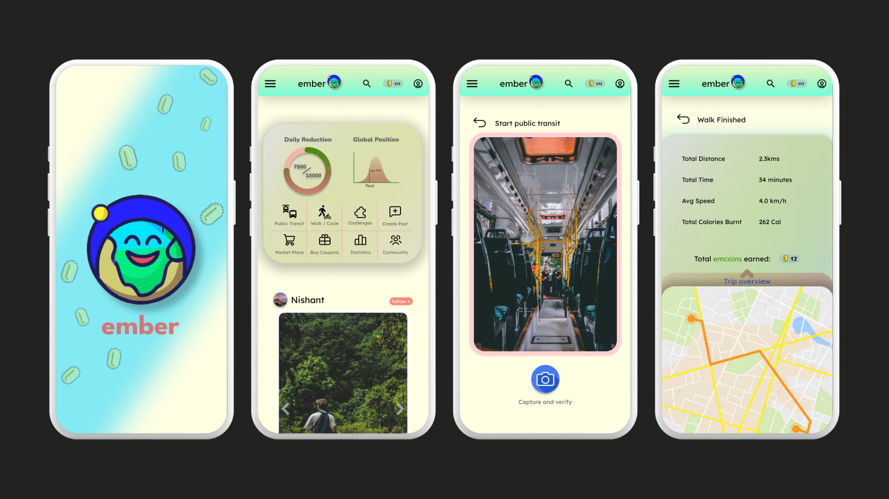
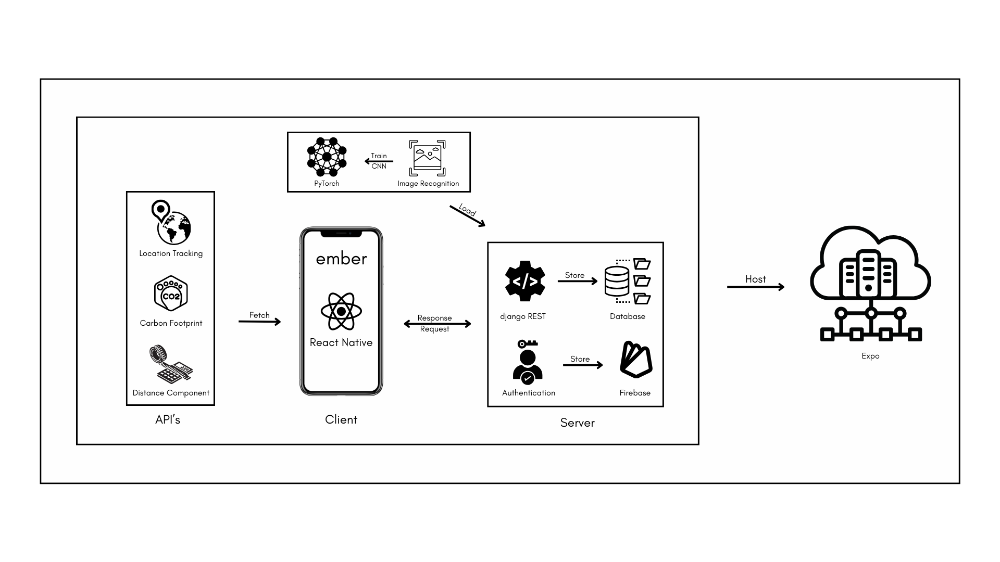

# Ember

***A Carbon Footprint App with Monetisation Strategies***

Welcome to Ember, your all-in-one platform for sustainable living.
- We offer eco-friendly transit solutions, gamified sustainability challenges, a thriving community hub, incentives for green actions, a green marketplace, and carbon offset options. 
- Our monetization strategies include advertisements, coupons, an eco-products marketplace, and location-based services.

***Join us in the movement towards a greener future today!***

### Mechanism

### Technology Stack
- Frontend: React-Native, TailwindCSS
- Backend: django REST
- Machine Learning: PyTorch

### Reference- Problem Statement
Urban areas face challenges like traffic congestion, air pollution, and carbon emissions due to increased private vehicle usage.
- To promote eco-friendly transportation options (walking, biking, carpooling, public transit), we need an innovative mobile app that uses gamification and social elements to motivate users, reduce private car dependence, and create
sustainable cities.
- Daily challenges, leaderboards, and a supportive community foster engagement, while real-time incentives, optimized route planning, and carbon footprint tracking enhance the experience and environmental impact awareness.
- With an intuitive interface and seamless integration, the application must
revolutionize urban commuting habits for greener, healthier, and vibrant spaces.

